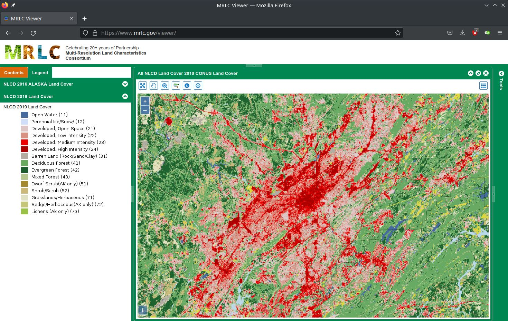
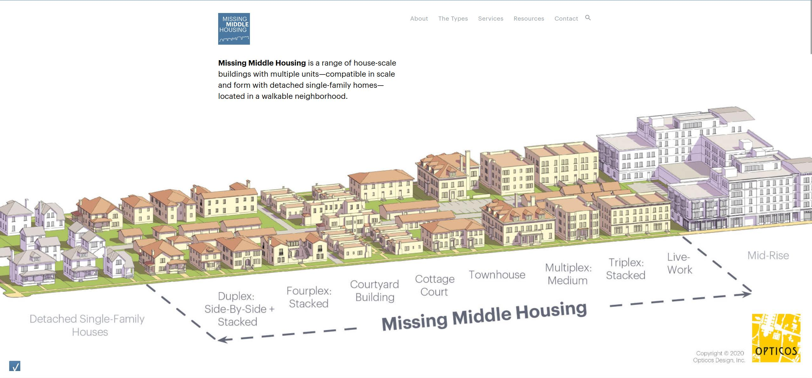

<!-- % Final Project Proposal
% CS 662 Natural Language Processing
% Date: 2022-10-14
---
geometry:
    - margin=1in
---

## Changes
* 2022-10-14 - Added table with references about portions of the IZC to be used for this project. Reworked few sentences of Zoning subsection to improve flow. Reworked last sentence of Concept section. -->

# Title: English NER Question to SPARQL Query for Zoning Ordinance Answering
 <!--  * Project title? "English NER Question to SPARQL Query for Zoning Ordinance Answering" -->

# Concept 
### (The Need):

Government regulations vary from town-to-town, city-to-city, and state-to-state.  Proponents tout this as a feature of being the great experiment that is the US Government.  Critics might cite it as being a failure that causes confusion and waste.  Objectively, there are thousands of communities with their own rules that can slightly differ from one to another.

For instance, the sale of fireworks is allowed in some communities, others do not permit them at all.  Fire works can cause fires and are a source of injury, but the sale of them can be sales revenue for a small town.  State line stores and adult businesses do the same thing, they have products that might be restricted in one jurisdiction that are legal in the other state.  An example for Alabama, the Authors' home state, is lottery tickets, business around the boarders of states get a lot of revenue from residents of states like Alabama because Alabama is one of the few states without a lottery.

Land development Regulations (and Building Codes) are a large portion of the laws for a local government. Members of our team worked for a small city and were authorities on roughly 500 pages of regulations. Reading and understanding those regulations takes time.

Land Development requirements have some commonality between regions, ideas are copied if not the laws themselves copied nearly verbatim, but there are rules which can diverge among locales.

What if a chatbot could guide a land developer (not software developer) or someone starting a business in development questions.  This chatbot would provides answers to simple answers without these professionals having to fully read and understand all the regulation.

A SPARQL interface to a Knowledge Graph for land development regulations would be a great benefit.  However, it excludes most of the general public from leveraging the information contained within.  Only someone adept with SPARQL and understanding land development regulations could make sense of the output of a SPARQL query.

This is a Question Answering problem using a small Knowledge Graph that is to be developed *in&nbsp;tandem* with a natural language interface.

# Background 
### (What can we Achieve?):

Land Development regulations determine how development can take place on a property.  Laws and regulations are written in natural language and also use lists and tables. There are subprocesses that aren't always reflected in a timetable for how long land development takes and what steps are included in one subprocess versus another. Some development is permitted and other development is disallowed. In our experience, most projects need a few small tweaks to comply with local regulations.

Land Development requirements can include several documents such as Excavation and Fill Ordinance, Flood Prevention Ordinance, Building/Fire/Residential/Energy Codes, Traffic Circulation Standards, Subdivision Division Regulations, Zoning Ordinance, and more.  Some communities have sectioned off these ordinances into a model that called their Unified Development Code. From our team's domain experience, there is evidence that a large portion of a City's regulations are development regulation.

Zoning is a land development regulation, a tool which separates different uses into Zoning Districts for Residential, Commercial, and Industrial purposes. ~~By separating some uses is just a tool for an urban planner might tell you it creates a harmonious and predictable way for a locale to change and grow.~~ Separating uses allows noxious use cases like chemical refining to be partitioned off from uses like residences, but this partitioning can also cause unwarranted separation. In some places it has been illegal for someone to open a small downtown bakery and live above that bakery. Due to overly strict separation, laws are constantly being relaxed to allow for more mixed use development. <!-- Relevance? How does this relate to the tool we want to build? How about this? --> These relaxations require access to an ever changing regulation base.

For a given project or business venture, there may be a myriad of laws that apply to a given project.  An experienced developer will know the basics, but for any given project there could be many rules that the same developer has never encountered.

What if there was a chatbot that a developer, entrepreneur, or citizen could ask questions about these regulations? Specific questions could be asked such as: 

 *  Can this business be located 200 Hobbs Street West?
 *  Is there any reason that a 20'x40' addition go the west side of the house at 1250 Elm Street West?
 *  Will there be enough lot area including parking to build a 10,000 square foot office building at 1600 Elm Street West?
 *  What is the process for opening a liquor store at 1400 11th Ave South? 

~~(These questions are dreaming, but a system coupled with GIS point address data with very accurate cadestral land base could eventually answer questions like this.  Some of these questions would scare me for a computer to answer when I worked as a local government employee.)~~

Some of these questions when answered by a bot would have scared our team members with local government experience and could have raised ethical concerns, but coupling domain knowledge to the computer methods should alleviate these concerns provided the chat bot presents sufficient correctness when parsing natural language questions presented by a user. <!-- Klunky (consider rewriting) -->

~~It would be nice if the chatbot would ask questions when there is some ambiguity, but that seems like it could be more advanced functionality.~~

For an eventual final version after incremental development, this type of technology would lead to a person being able to have a dialog with a digital assitant like Alexa, Google, or Siri starting, for example with, "Hey Alexa, I'd like to buy a lot and build a home on it."  The digital assistant would in turn ask specific followup questions and help with relevant next steps guiding the user through the process of completing a series tasks such as: (1) buying a lot, (2) selecting a house plan that fits on the lot, (3) securing a construction loan, (4) hiring a general contractor, and so on.  The research presented in this project is a piece of the work needed to make this a reality.

# Project 
### (General Outline of the Project and Steps to Prototype):
~~Here's a general plan of some of the work that will need to happen:~~

1. Create a Knowledge Graph for a subset of Land Development Regulations for one jurisdiction.  Some of the ambiguity will be culled to make this not as difficult.
    * This small subset may include one (or more) of the following areas (these have been select for being major areas of regulation that most Zoning Ordinance regulate): 
      * land use - specifically, permission to do a particular use in a particular Zone.
      * (minimum) parking requirements for a Use
      * basic dimensional requirements for Districts
2. Use NLP methods to parse a question prompt.
    * Basic outline:
      * create training and test data in the form of a JSON dictionary with fields for question, relevant words, question type, and SPARQL template class. Two ground truths exist per question, the correct selection of template and the expected answer.
      * NER and POS tagging to parse the question into the relevant query terms
      * word embeddings and cosine similarity to identify synonyms to a set dictionary of terms used by the IZC regulatory database
      * clasification of the question type to a limited set of SPARQL templates
3. Create a SPARQL query from the selected template passing the relevant terms from the NLP processor to use on the Knowledge Graph.
4. Produce an answer.
5. Check answer for correctness.
    * Some answers may be fine or preferable to give a table like Wolfram alpha, example queries ["number of reddit users" - https://www.wolframalpha.com/input?i=number+of+reddit+users](https://www.wolframalpha.com/input?i=number+of+reddit+users) and ["distance of earth from sun" - https://www.wolframalpha.com/input?i=distance+of+earth+from+sun](https://www.wolframalpha.com/input?i=distance+of+earth+from+sun), or a single answer. A full sentence answer may be required for some questions.

Real-time processing or short wait processing of questions is desired, but is **out of scope** for this initial version.

~~Each step of the way, create a some kind of output of what is going on, if possible.~~ Verbose output will be available as a toggle. This will allow for debugging during each phase of development and operation.

~~Off the top on my head, the technologies that I would proposed would be~~ The technologies to be used will be Python, Flask, Java, SPARQL, and MongoDB.  ~~I'm curious if there will be some kind of bottleneck with using Python.~~

Visualization could be stored as JSON to be able to be plugged into MongoDB, and retrieved for later analysis. AJAX could update the website to show the results as they are happening. It will be important to keep track of a job's runtime. A database of results with the Github commit code version used to produce that result and the date ran will be kept.

This will help support future creation of a larger Knowledge Graph that would encompass more aspects of land development regulations.

# Knowledge Graph 
### (Parallel Development to and for the Project):

Our knowledge graph will use a format to store triples,  RDF, RDFa, Turtle, or JSON-LD. There are a number of methods used for this purpose.

Embedding this Knowledge Graph in HTML, so RDFa or JSON-LD could be used is the longterm goal.

[Apache Jena - https://jena.apache.org/](https://jena.apache.org/) is a triple store database software that our team has been using to do basic queries. This software is Java, but we have found a way to inegrate this with python for smoother operation. Jena supports JSON for Linking Data (JSON-LD).

# Land Use is Complicated 
### (Scope of the Problem):

Land use in and of itself is a complicated topic with many facets.

Land Cover classification of large areas from satellite imagery may give a very coarse categories: Urban, forest, water, wetland, crops, and so on ([Multi-Resolution Land Characteristics [MRLC] Consortium - https://www.mrlc.gov](https://www.mrlc.gov)).  At one time, this was also referred to as land use.

{ width=77% }

Some ideas about landuse will be firmly out of scope because they are not useful to land development regulation.  Land use can mean a former use that has been abandoned, like an old train depot that is unused.  A train depot that has been restored to a museum, was still once at train depot.  The current use of being a museum is most important in this context.

The American Planning Association created comprehensive list land uses published in 2001 called the [Land Based Classification Standards - https://www.planning.org/lbcs/standards/](https://www.planning.org/lbcs/standards/).  They have five categories of land use, activity, function, structure type, site development character, and ownership.  ~~There are some ideas here, but I don't think this will be useful for this project.~~ Some of these will be useful to the project while others will not.

Land uses can encompass large categories of uses including agricultural, residential, commercial, and industrial.

A Zoning Ordinance regulates Zoning Districts which in turn control land use for a community.  Uses mainly fall into 3 categories: permitted uses, needing special board approval to grant permission, or not permitted. Land uses can be given in a list or in tables:

Tables like the above are meant to convey the information visually organized manner.  This table has words with line breaks and a symbolic code for the meaning (for symbols P, C, and so on).  Decoding the table of symbols and converting into something database-like will make it much easier to compute.  Something that can be searched for a particular land use.

Zoning ordinances typically also regulate building form with land use. A single-family house, duplex, and apartments are all building forms.

The North American Industry Classification System (NAICS) provides a classification system ([NAICS U.S. Census Bureau - https://www.census.gov/naics/](https://www.census.gov/naics/)) for all uses that are not residential (non-residential).  It uses a numeric system that is a specific business, remove a number from the end an you get a broader category.  Here's a table showing the relationships encoded in the 6-digit code 722511:

 NAICS  |        Category
:-------|-------------------------
 722511 |  Full-Service Restaurant
 72251  |  Restaurants and Other Eating Places
 7225   |  Restaurants and Other Eating Places
 722    |  Food Services and Drinking Places
 72     |  Accommodation and Food Services

Within the 72251x category there are other similar kinds of establishments, which include:

 * Drinking Places (Alcoholic Beverages); 
 * Limited-Service Restaurants; 
 * Cafeterias, Grill Buffets, and Buffets;
 * and Snack and Nonalcoholic Beverage Bars.

NAICS can be represented with a tree-link structure.

A Zoning Ordinance may treat many of these the same.  Alcoholic beverages may be treated differently because of state laws and a community's laws.  Omit that concern, if it isn't mentioned in the IZC.

NAICS is updated every 5 years.  Similar kinds of businesses are It has been in existence since 1997 and replaced an older system.

Mixed use buildings is a somewhat uncommon form, but are a growing trend.  These are too complicated to worry about for our purposes.

With a little bit of work NAICS could be worked into general categories for non-residential uses: Commercial and Industry.  Different communities will disagree on classifications for some of the businesses in the middle.  Having some businesses in industrial districts support the workers that are nearby.  A restaurant is a business, but having in an industrial district may create a community eatery for the nearby industrial workers.  A person doing leather-work might technically be manufacturing, but that might be fine in Business district because the effects are not that many.  Even if you do create a perfect classification system, communities will disagree on what should be industrial or commercial.  The division between those uses is not quite as stark as the division between residential and non-residential.  There have also been effort to have less ridge zoning, but that's too far in the weeds.

NAICS works well for non-residential uses, but another classification will need to be made for residential forms. It would probably be easier to create a list of residential forms and then generate a table of said forms (presumably there are fewer than 50), but forms need to have acceptable synonyms "duplex = two-family dwelling" and "accessory dwelling unit = mother-in-law suite".  Many of the forms of housing have widely varied names for the same uses. 

{ width=77% }

Some locales use NAICS numbers to identify and regulate use. For instance, The City of Auburn Zoning Ordinance does this, but their numbers use an older NAICS numbering scheme, likely from 2007 or older.  NAICS has Excel tables for translation between the 5 year updates. 

The [2022 NAICS tables - https://www.census.gov/naics/?48967](https://www.census.gov/naics/?48967) are provided in Excel format and available for download in many different scopes.

# Source

## Zoning
The source law that should be used to create the Knowledge Graph should be the International Zoning Code.  [2021 International Zoning Code (IZC)- https://codes.iccsafe.org/content/IZC2021P1](https://codes.iccsafe.org/content/IZC2021P1)

This is a simple zoning ordinance that hides a lot of complexity of other Zoning Codes.  There are communities in a number of states that have adopted this as their zoning ordinance.  It also fairly up to date. Relatively little changes in this code from the 3 year updates.

In comparison to other similar size suburban zoning ordinances, this one has likely been thoroughly reviewed.

It is a static document that should be fairly easy for anyone to get a copy for hopefully at least the next decade or two.  If a particular locale's Zoning Ordinance is used, it is subject to change at any time.  Many locale don't have an interest in keeping around old copies of zoning ordinances. (Some of this can be due to concerns about people using old copies of their laws and thinking those are current.)

That being said there only portions list in the table will be the most useful to create a Knowledge Graph.  Other sections may be used if there is a relevant definition or phrase for NLP purposes.

 Purpose                    Location in IZC
-------------------------- ----------------------------------
 Dimensional Requirements   §402.1, §502.1, §602.1, & §702.1
 Permitted Uses             §401.1, §501.1, §601.1, & §701.1 
 Parking Requirements       Table 801.2.1

The IZC is copyrighted and the owner, the International Code Council (ICC), has rights in how the content can be used.  Outside of an educational context (such as publishing a paper), permission will need to be sought.  Not a concern for this class project.  However, ICC is more well known for the their Building and Fire codes.  The owner should be around for a long time, which a concern also outside of this project. 

## Flood

**There is probably no time to do this.** Flood regulations are to ensure that any development within a flood district will have a finished floor elevation above the modeled 1% base flood elevation (colloquially called the 100-year flood -- which is a problematic name).  The model flood ordinance is created by the [Alabama Department of Economic and Community Affairs (ADECA) - https://adeca.alabama.gov/floods/resources-forms-and-links/](https://adeca.alabama.gov/floods/resources-forms-and-links/)and is 24 pages for coastal communities and 36 pages for riverine communities.  This model ordinance is specifically for Alabama.  There are likely similar equivalents for most states.  A model ordinance uses very similar language, but can be somewhat tailored to local needs/desires/conditions.  A model ordinance means that it mostly will work the same with a little customization in some areas.  One base model with small variations for all the different communities.  **Again, there is probably no time to do this.** 

# NLP Work
This will need to identify in a questions the following elements: zoning district, dimension, and a land use.

Zoning District Names could be based on types within the graph type.  Land uses are going to be trickier.  There may need to be some relationship in the graph that says specific use, Restaurant, is a subclass of larger class of uses, Commercial use.

NAICS is still still a relevant list and may best description for what non-residential activity is taking place.  WordNet may be a possible source for synonyms for land uses.  It may be easier for me to just generate a list.

# Resources

This is a good place to start:

* [RDF 1.1 Primer - https://www.w3.org/TR/rdf11-primer/](https://www.w3.org/TR/rdf11-primer/). W3C Working Group Note 24 June 2014.

Here are papers which cover similar topics:

* S. Aghaei, E. Raad and A. Fensel, "Question Answering Over Knowledge Graphs: A Case Study in Tourism," in IEEE Access, vol. 10, pp. 69788-69801, 2022, doi:10.1109/ACCESS.2022.3187178.

* Y. -H. Chen, E. J. -L. Lu and T. -A. Ou, "Intelligent SPARQL Query Generation for Natural Language Processing Systems," in IEEE Access, vol. 9, pp. 158638-158650, 2021, doi:10.1109/ACCESS.2021.3130667.

* A. Ait-Mlouk and L. Jiang, "KBot: A Knowledge Graph Based ChatBot for Natural Language Understanding Over Linked Data," in IEEE Access, vol. 8, pp. 149220-149230, 2020, doi:10.1109/ACCESS.2020.3016142.

# Appendix A. Sample Questions

This section contains questions with answers, tricky questions that requires some followup, and questions with a negative answer.  These types of questions should be used for testing.  More of these types of questions can be created.  Probably some analysis needs to be done to try to show how many graph nodes need to be involved.  If this system can answer 20% of the questions somewhat well, I would be happy. 

## Questions that have answers.

### Permitted Use
Which zoning district permits duplexes?

 * Listed as "two-family dwelling", a few, so R-2 and R-3 (and all the subdivisions thereof).

Which zoning district allows apartments?

 * Permit is the most technically correct way to ask the question, but allow is synonymous with permit and is widely used.

Which zoning district allows restaurants?

 * This one has more than one district.

Which zoning districts permit an accessory dwelling unit?

 * called "accessory living quarters"

Are auto sales allowed in a C-2 zoning district?

 * yes.

Is a bank allowed in a C-1 zoning district?

 * yes, listed a "financial services"

Where would a church be allowed?

 * "places of religious worship", all the C zones, all the CR zones, and all of the FI zones.

### Parking Requirements

How many parking spaces are required for a 2000 square foot restaurant?

 * 20

Will 20 parking spaces meet the parking requirements for a 5,000 square foot office?

 * Yes, only 17 are required.

### Dimensional Requirements

What is the front setback for a building in the C-1 zoning district?

 * 0 feet

What is the minimum lot Depth in an R-1a zoning district (R-1a Residential Zone Division 1a)

 * 150 feet.

What is the maximum building height in a FI-2 zoning district?

 * 80 feet. 

What is the minimum lot size in an R-1b zoning district?  (R-1b Residential Zone Division 1b)

 * 20,000 square feet

## Tricky questions
These are questions that may need some additional input to verify two paths.

### Permitted Uses
 * Any questions about a specific business name could be problematic.  DBPedia/Wikipedia could be used as sources, but it is best to ignore this problem and say it is **out of scope**.

In what zoning district can a Church's Chicken be built?

 * Would it identify this is as a church for livestock instead of a fast-food restaurant?  How do you respond to a question about a specific franchise being built, such a a McDonalds.  It is easier to consider specific business names an **out of scope** problem.

Which zoning district allows mining?

 * FI-3, listed as "quarries", which is a type of mining.

### Dimensional
What is the side setback for a R-1b zoning district?

 * This should probably be omitted because it is a tricky question to answer. The IZC seems to interpret a corner lot to have frontage, thus a side setback with a road has to have the front setback.  This isn't an easy question to answer and requires some knowledge.

 * 10 feet (side setback)

## Questions that have a negative answer.

Can a duplex be built in an R-1d zoning district?

* No

